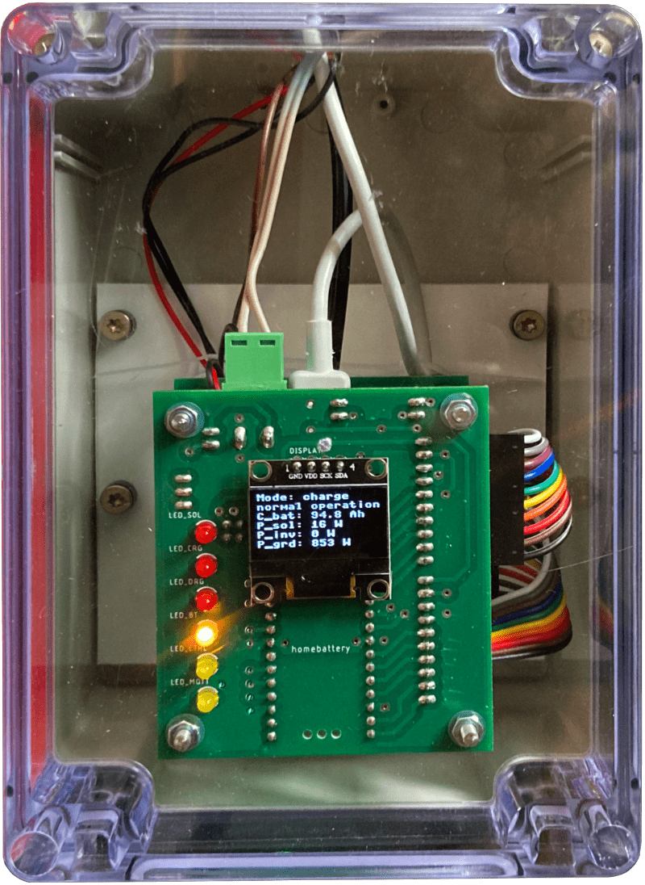

# homebattery

Welcome to the homebattery project.

## What is homebattery?

Homebattery is an embedded controller for your home battery storage (or EV charger). Its working principle is very simple:

* devices are connected to homebattery via various interfaces.
* homebattery switches its mode of operation (basically charging, idle and discharge) when a corresponding command is received via MQTT.
* if an operational parameter is not okay, homebattery automatically shuts off affected devices.
* a collection of relevant operational parameters is published via MQTT for further usage.

Homebattery comes with:

* open source hardware built around the Raspberry Pi Pico W 
  * some simple setups even work with a bare Raspberry Pi Pico W
* the homebattery firmware written in microPython
* extensive documentation: http://homebattery.readthedocs.io

## Typical use cases

* Usage with a home battery storage system with grid and/or solar chargers. Dynamic energy pricing is used. Business logic in a home automation system is used to switch homebattery between charging, discharging and idle depending on the current energy prices.

* Usage with a battery charged by solar power. Homebattery monitors the system and activates the inverter as long as the battery SOC is not too low.

* Usage without a whole home battery storage, but single devices. Homebattery publishes their data via MQTT to an home automation system, which then controlls other devices based on this data.

The following use cases are not supported with the current version of the software, but will come in the future:

* Usage with an EV charger/ AC coupled battery system and solar power. While homebattery does not control the solar system itself, it adapts the charging power to the solar production to only use suplur energy for charging.

* Usage with hardware that would be not compatible with each other normally. As an example, a Pylontech battery can not directly be charged via Victron MPPT solar chargers, since they use different communication protocols. With homebattery, such setups are possible.

## Why homebattery?

Homebattery was not the first and will not be the last solution for controlling your home battery storage, but it has some nice features you might be interested in:

* **reliability** by using an embedded system with a watchdog timer, homebattery is much more reliable than a bare home automation solution.
* **safety checks** ensure that all device parameters are in the green range. If not, homebattery reacts accordingly. E.g., the inverter gets automatically turned off if the SOC of the battery gets too low.
* **simplicity** is achieved by only caring about device communication and safety. The business logic is implemented in your home automation solution.
* **modularity** was the design principle for both the hard- and the software. A wide variety of devices and physical interfaces (Bluetooth, ethernet, RS485, VE.Direct, ...) is supported thanks to the usage of add-on boards and drivers. And even more will be suported in the future.
* **MQTT** is used to communicate with homebattery. So everything with MQTT support can be used to control homebattery (Home Assistant, ioBroker, etc.). The MQTT interface is well documented.

## What do I need?

* **homebattery hardware**. If you only connect devices via network and Bluetooth, even a bare Raspberry Pi Pico W will do the job.
* for most use cases, **a smart home solution** like Home Assistant or ioBroker. You can use any software that is capable of MQTT.
* **compatible devices**. See the list below.

## What hardware is supported?

| Group | Device family | Tested devices | Connection method | Remarks |
| - | - | - | - | - |
| battery | LLT Power BMS | Accurat Traction T60 LFP BT 24V | Bluetooth         | many China LiFePo4 batteries use this BMS |
| | Daly H-Series Smart BMS | Daly H-Series Smart BMS 8S 60A | Bluetooth | - |
| | JK BMS BD4-Series | BD4A17S4P | Bluetooth | - |
| solar charger | Victron SmartSolar MPPT | Smartsolar MPPT 75/15 | VE.Direct | - |
| | Victron BlueSolar MPPT | - | VE.Direct | configuration is still done via Victron USB interface |
| grid charger | Shelly smart switch | Shelly Plus2PM Shelly Plug S | network | - |
| inverter | Hoymiles HM-Series | HM-300 | network | requires AhoyDTU |

## How to start?

Please read the handbook in the documentation.

## Disclaimer

While homebattery was designed with high operational safety in mind and has already some installations deployed, there is no warranty for anything.
Please keep in mind that a home battery storage comes with stuff that can cause a fire or explosion if done wrong:
* high currents
* chemicals storing a high amount of energy

The quality of the electical setup is crucial. So please ensure that it is done by someone knowing what he or she is doing and, maybe even more important, care about maintenance.

THE SOFTWARE IS PROVIDED “AS IS”, WITHOUT WARRANTY OF ANY KIND, EXPRESS OR IMPLIED, INCLUDING BUT NOT LIMITED TO THE WARRANTIES OF MERCHANTABILITY, FITNESS FOR A PARTICULAR PURPOSE AND NONINFRINGEMENT. IN NO EVENT SHALL THE AUTHORS OR COPYRIGHT HOLDERS BE LIABLE FOR ANY CLAIM, DAMAGES OR OTHER LIABILITY, WHETHER IN AN ACTION OF CONTRACT, TORT OR OTHERWISE, ARISING FROM, OUT OF OR IN CONNECTION WITH THE SOFTWARE OR THE USE OR OTHER DEALINGS IN THE SOFTWARE.
