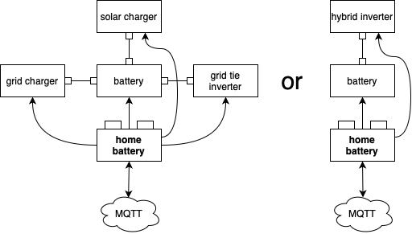

# homebattery

Welcome to the homebattery project.

## What is homebattery?

Homebattery is an embedded controller for your home battery storage. Its working principle is very simple:

* devices are connected to homebattery via their respective interfaces
* homebattery switches the mode of operation (charge, discharge, ...) when a corresponding command is received via MQTT
* if an operational parameter of any connected device is not okay, homebattery automatically shuts off affected devices for safety
* a collection of relevant operational parameters is published via MQTT for further usage

Homebattery comes with:

* open source hardware built around the Raspberry Pi Pico W 
  * some simple setups even work with a bare Raspberry Pi Pico W
* the homebattery firmware written in microPython
* extensive documentation: http://homebattery.readthedocs.io

## Typical use cases

* Home battery storage in combination with dynamic energy pricing. Dending on rules programmed in a home automation system, homebattery switches between charging, discharging and idling the battery depending on the current energy price.

* Home battery storage charged by solar. Homebattery monitors the system and disables the inverter if the battery SOC gets too low.

* Getting "incompatible" devices to talk to each other. Since homebattery supports a wide range of devices, protocols and connection methods, it can be used to combine devices with no direct communication possible, e.g. Pylontech batteries and Victron MPPT solar chargers.

* Connecting single devices to a home automation system. Homebattery can give different devices a common interface via MQTT for further usage.

## Why homebattery?

Homebattery was not the first and will not be the last solution for controlling your home battery storage, but it has some nice features you might be interested in:

* **reliability** is achieved by usage of an embedded system with a watchdog timer, so homebattery is much more reliable than a home automation solution running on a regular PC or Raspberry Pi
* **safety checks** ensure that all device parameters are in the green range. If not, homebattery reacts accordingly to prevent damage from any device.
* **simplicity** is achieved by only caring about device communication and safety. The logic when to switch the mode of operation is implemented in your home automation solution.
* **modularity** was the design principle for both the hard- and the software. A wide variety of devices and physical interfaces (Bluetooth, ethernet, RS485, Modbus, VE.Direct, ...) is supported thanks to the usage of add-on boards and drivers. And even more will be suported in the future.
* **MQTT** is used to communicate with homebattery. So everything with MQTT support can be used to control homebattery (Home Assistant, ioBroker, etc.). The MQTT interface is well documented.

## What do I need?

* **homebattery hardware**. The [documentation](http://homebattery.readthedocs.io) contains a guide which hardware is necessary for witch connected devices
* **a smart home solution** like Home Assistant or ioBroker, if you want implement some logic when to switch mode of operation. You can use any software that is capable of MQTT.
* **compatible devices**. See the list below.

## What hardware is supported?

| Group | Device family | Tested devices | Connection method | Remarks |
| - | - | - | - | - |
| battery | LLT Power BMS | Accurat Traction T60 LFP BT 24V | Bluetooth         | many China LiFePo4 batteries use this BMS |
| | Daly H-Series Smart BMS | Daly H-Series Smart BMS 8S 60A | Bluetooth | - |
| | JK BMS BD-Series | BD4A17S4P BD6A17S6P | Bluetooth | - |
| solar charger | Victron SmartSolar MPPT | Smartsolar MPPT 75/15 | VE.Direct | - |
| | Victron BlueSolar MPPT | - | VE.Direct | configuration is still done via Victron USB interface |
| grid charger | Shelly smart switch | Shelly Plus2PM Shelly Plug S | network | - |
| inverter | Hoymiles HM-Series | HM-300 | network | requires a AhoyDTU device |
| | Growatt xx00-S series | 1000-S | RS485 / modbus | - |
| | Growatt MIC xxTL-X series | MIC 1500TL-X | RS485 / modbus | -

## How to start?

Please read the [handbook](https://homebattery.readthedocs.io/en/latest/handbook/index_handbook.html)  in the [documentation](https://homebattery.readthedocs.io/en/latest/).

## Disclaimer

While homebattery was designed with high operational safety in mind and has already some installations deployed, there is no warranty for anything.
Please keep in mind that a home battery storage comes with stuff that can cause a fire or explosion if done wrong:
* high currents
* chemicals storing a high amount of energy

The quality of the electical setup is crucial. So please ensure that it is done by someone knowing what he or she is doing and, maybe even more important, care about maintenance.

THE SOFTWARE IS PROVIDED “AS IS”, WITHOUT WARRANTY OF ANY KIND, EXPRESS OR IMPLIED, INCLUDING BUT NOT LIMITED TO THE WARRANTIES OF MERCHANTABILITY, FITNESS FOR A PARTICULAR PURPOSE AND NONINFRINGEMENT. IN NO EVENT SHALL THE AUTHORS OR COPYRIGHT HOLDERS BE LIABLE FOR ANY CLAIM, DAMAGES OR OTHER LIABILITY, WHETHER IN AN ACTION OF CONTRACT, TORT OR OTHERWISE, ARISING FROM, OUT OF OR IN CONNECTION WITH THE SOFTWARE OR THE USE OR OTHER DEALINGS IN THE SOFTWARE.
