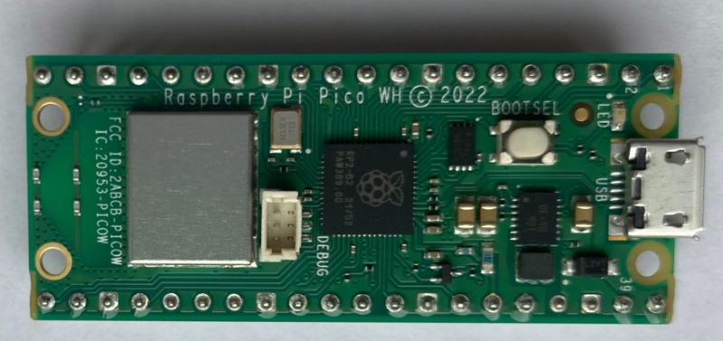
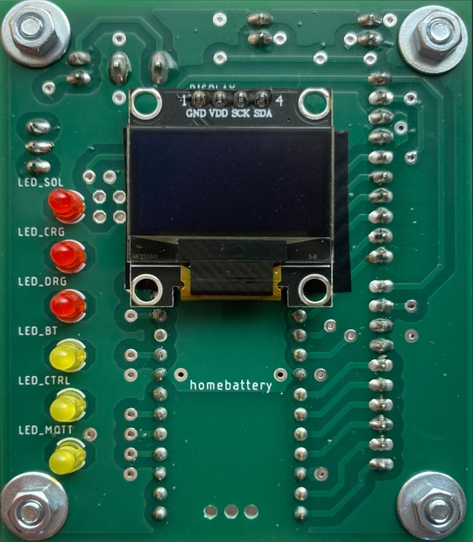
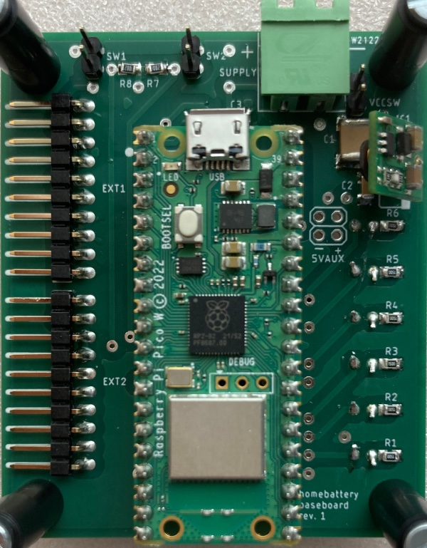
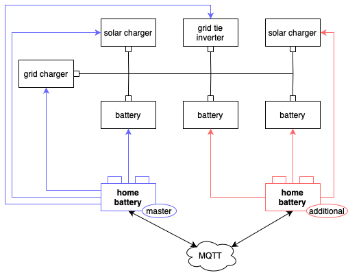
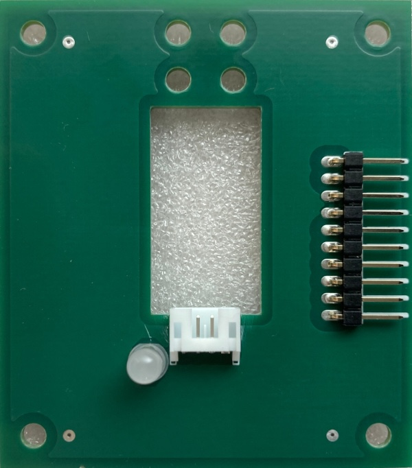
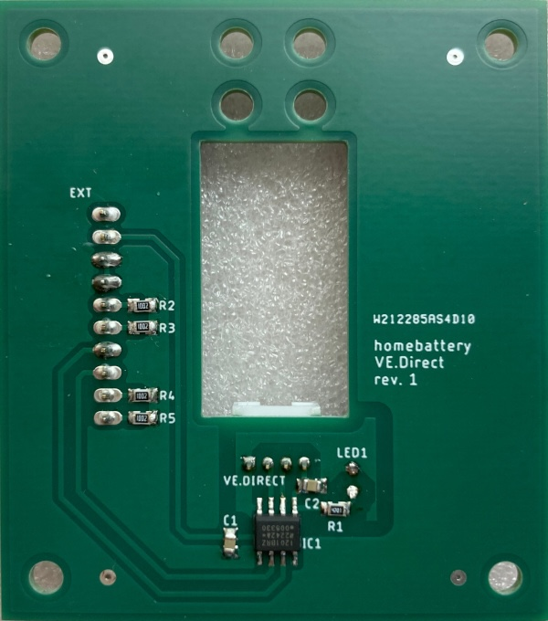

Hardware selection
==================

Raspberry Pico W only setups
----------------------------

homebattery supports running on a bare Raspberry Pico W. The system is then usually powered by a phone charger connected to the micro USB port.

This setup comes with a few limitations:

* devices can only be connected via network or Bluetooth
* no display or LEDs

Raspberry Pico W on baseboard
-----------------------------

homebattery comes with a baseboard featuring

* an OLED display
* status LEDs
* powering via wide voltage range input or micro USB
* two extension slots for add-on boards

For more information, see TODO.

Multi controller setups
-----------------------

If one Raspberry Pico W (with or without baseboard) is not sufficient to connect all devices, multiple controllers can be combined to one system.

Example setup:

In a usual multi controller setup, all grid charges and inverters are connected to one main controller. Solar chargers and batteries can either be connected to the main controller or to one or more additional controllers.

For more information, see TODO.

Add-on boards
-------------

VE.Direct
~~~~~~~~~

Victron SmartSolar and BlueSolar MPPT solar charges can be connected to homebattery using the VE.Direct add-on board.

For more information, see TODO.

.. note::
   Your solar charger must be configured to switch its charger output with the TX pin when using this add-on board. See TODO for more information.

