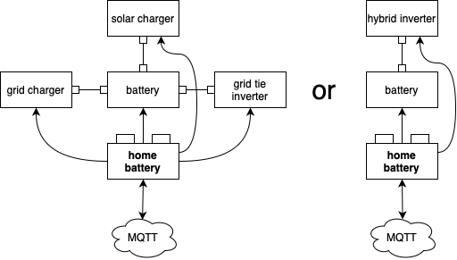

System overview
===============

A typical home battery storage system
-------------------------------------

A home battery storage system usually consists of at lead four components:

* batteries
* chargers (powered by solar or grid)
* inverters
* a controller

Some devices are multiple components at the same time (e.g. a hybrid inverter is usually solar charger, grid charger and inverter).

The homebattery as controller of the system has two main tasks:

* control the chargers and inverters to charge and discharge the batteries
* monitor the system and go into safe state in case of an error.

.. note::
   homebattery does not control when to charge or discharge the battery, this is set via MQTT. It just controls the corresponding hardware.

Modes of operation
------------------

The mode of operation is set via MQTT:

+-----------+-------------------------------------+--------------------------------------------------+
| Mode      | grid tie systems                    | hybrid inverter systems                          |
+===========+=====================================+==================================================+
| idle      | Battery is charged from solar, grid | Battery is charged from surplus solar energy,    |
|           | charger and inverter are off.       | inverter output is fed by solar + grid           |
+-----------+-------------------------------------+--------------------------------------------------+
| charge    | Battery is charged from solar and   | Battery is charged from solar and grid, inverter |
|           | grid, the inverter is off.          | output is fed from grid.                         |
+-----------+-------------------------------------+--------------------------------------------------+
| discharge | Battery is charged from solar, the  | Battery is charged from surplus solar energy,    |
|           | gridcharger is off, while the       | inverter output is fed by solar + battery.       |
|           | inverter is on.                     |                                                  |
+-----------+-------------------------------------+--------------------------------------------------+
| protect   | All chargers and inverters are off. | Battery is not charged, inverter output is fed   |
|           |                                     | by grid                                          |
+-----------+-------------------------------------+--------------------------------------------------+

.. note:: 
   homebattery will automatically switch off devices if they are not save to operate (e.g. all chargers will be switched off if a battery cell voltage gets too high). In this case, the mode of operation might change without command from external.

Connecting devices
------------------

There are four device classes:

* battery
* solar
* charger
* inverter

homebattery offers high flexibility regarding its connected devices:

* all device classes are optional (e.g. you can have a system without a grid charger)
* there can be multiple devices per class
* devices can be distributes across several controllers (see TODO multi controller setups)
* devices can be a combination of device classes (e.g. a hybrid inverter is usally solar, charger and inverter)

There are several ways to connect devices:

* network via WLAN
* Bluetooth (only for batteries)
* wired connections via add-on boards

The used interface depends on the device, see the corresponding documentation in TODO drivers.

System monitoring
-----------------

There are several ways to monitor the operation of the home battery storage system when using homebattery.

The system status and a collection of operating data from the connected devices are sent over MQTT and can be visualized in the home automation system of your choice.

When using the baseboard, system status and some operating data is visualized by display and LEDs.

Detailed information can also be retrieved by the system log, see TODO logging.

