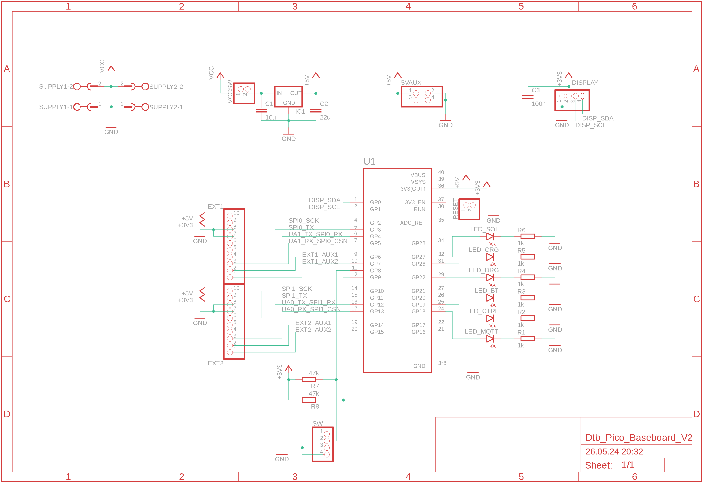
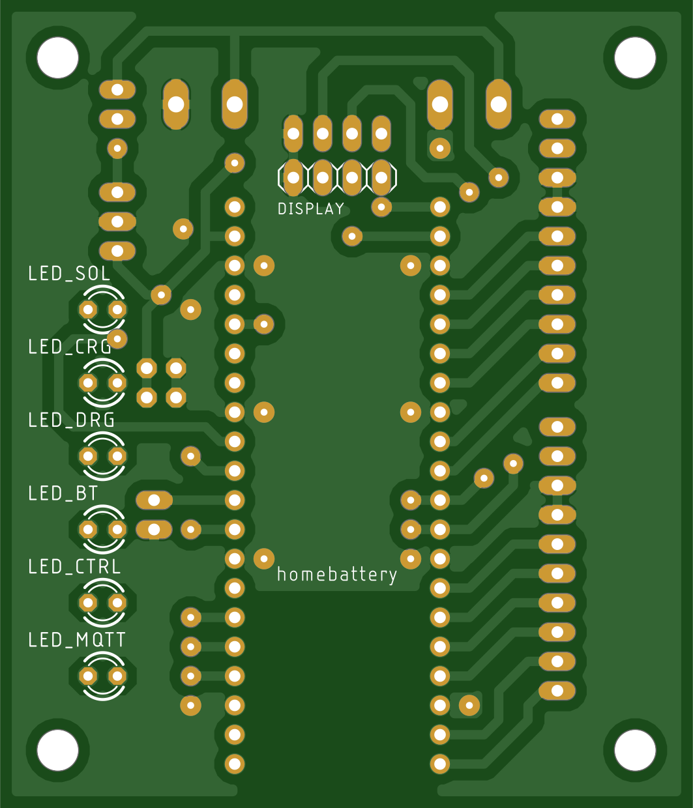
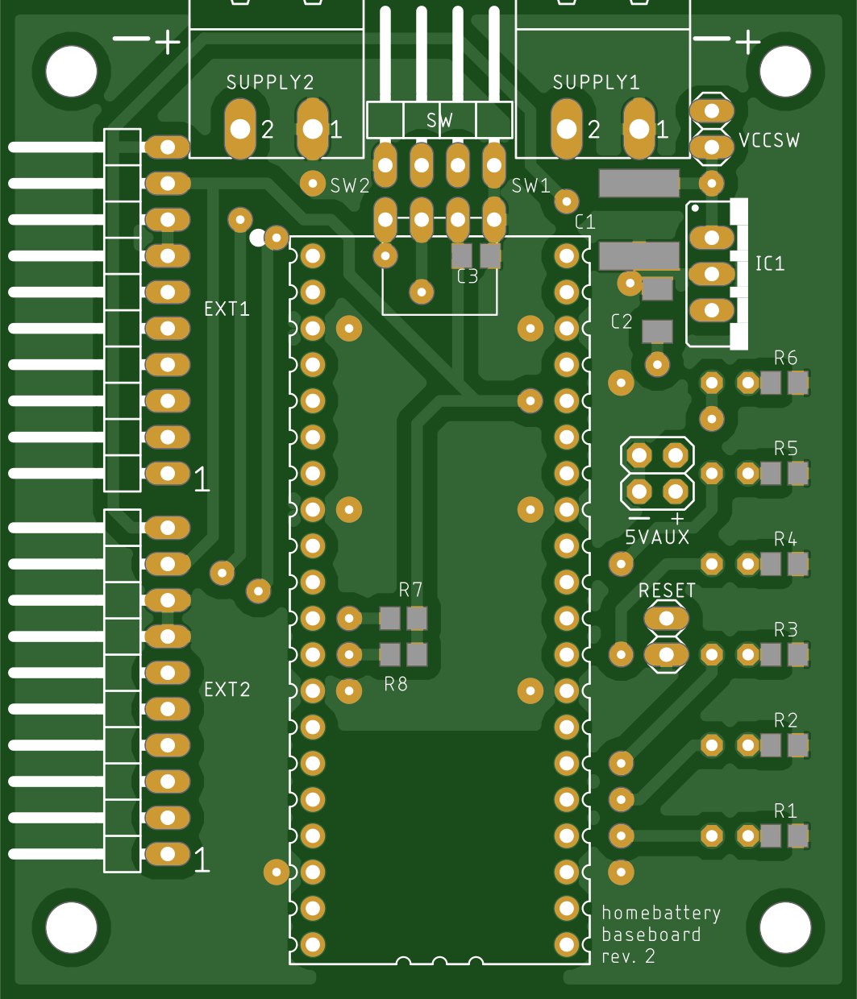

Baseboard
=========

Schematics
----------

PCB
---

Bill of materials
-----------------

+------------+-----------------------------------------------+--------+-----------------------------------------+
| Name       | Description                                   | Number | Reichelt name / Remark                  |
+============+===============================================+========+=========================================+
| U1         | Raspberry Pi Pico WH                          | 1      | RASP PI PICO WH                         |
+------------+-----------------------------------------------+--------+-----------------------------------------+
| U1         | socket terminal strip 20-pin RM 2.54          | 2      | BL 1X20G8 2,54                          |
+------------+-----------------------------------------------+--------+-----------------------------------------+
| DISPLAY    | 0.96" SSD1306 I2C OLED 128x64 display white   | 1      | buy one from ebay or alixpress          |
+------------+-----------------------------------------------+--------+-----------------------------------------+
| SUPPLY     | clamp terminal block male connector RM 5.08   | 2      | CTB9359-2                               |
+------------+-----------------------------------------------+--------+-----------------------------------------+
| SUPPLY     | clamp terminal block female connector RM 5.08 | 2      | CTB9209-2                               |
+------------+-----------------------------------------------+--------+-----------------------------------------+
| VCCSW, SW  | jumper RM 2.54                                | 2      | JUMPER 2,54GL SW                        |
+------------+-----------------------------------------------+--------+-----------------------------------------+
| VCCSW      | pin headers 2-pin straight RM 2.54            | 1      | MPE 087-1-002                           |
+------------+-----------------------------------------------+--------+-----------------------------------------+
| SW         | pin headers 4-pin angled RM 2.54              | 1      | W+P 946-144                             |
+------------+-----------------------------------------------+--------+-----------------------------------------+
| EXT1, EXT2 | pin headers 10-pin angled RM 2.54             | 2      | W+P 946-14-010                          |
+------------+-----------------------------------------------+--------+-----------------------------------------+
| IC1        | dc/dc converter 5V 2.5W SIL package           | 1      | LMO78_05-0.5                            |
+------------+-----------------------------------------------+--------+-----------------------------------------+
| C1         | MLCC capacitor 10u 50V X7R G2220              | 1      | ECC KTS500B106K                         |
+------------+-----------------------------------------------+--------+-----------------------------------------+
| C2         | MLCC capacitor 22u 10V X7R G1206              | 1      | X7R-G1206 22/10                         |
+------------+-----------------------------------------------+--------+-----------------------------------------+
| C3         | MLCC capacitor 100n 50V 100n G0805            | 1      | KEM X7R0805 100N                        |
+------------+-----------------------------------------------+--------+-----------------------------------------+
| R1 - R6    | SMD resistor 1k 1/8W 0805                     | 6      | WAL WR08X1001FTL                        |
+------------+-----------------------------------------------+--------+-----------------------------------------+
| R7, R8     | SMD resistor 47k 1/8W 0805                    | 2      | WAL WR08X4702FTL                        |
+------------+-----------------------------------------------+--------+-----------------------------------------+
| | LED_SOL  | LED red 3mm 60° 150 mcd 20mA                  | 3      | 3004R1D-EHB-A                           |
| | LED_CRG  |                                               |        |                                         |
| | LED_DRG  |                                               |        |                                         |
+------------+-----------------------------------------------+--------+-----------------------------------------+
| | LED_BT   | LED yellow 3mm 60° 150 mcd 20mA               | 3      | 3004Y1D-EHB-A                           |
| | LED_CTRL |                                               |        |                                         |
| | LED_MQTT |                                               |        |                                         |
+------------+-----------------------------------------------+--------+-----------------------------------------+

