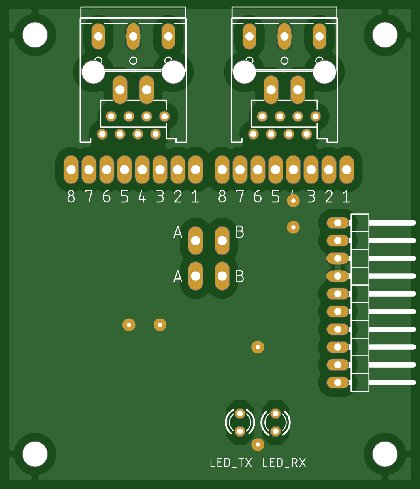
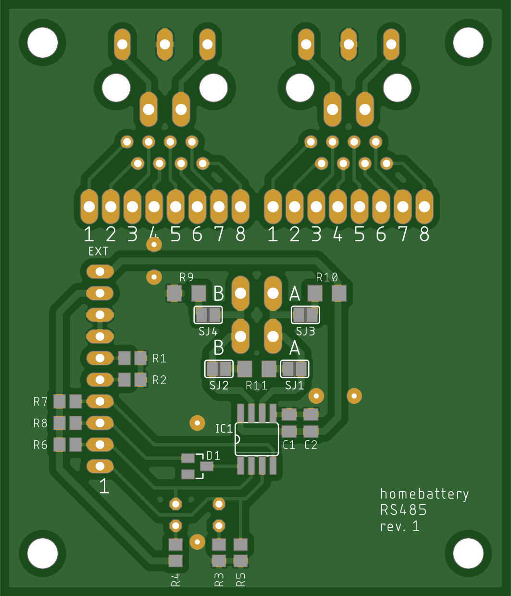

RS485
=====

Schematics
----------

.. image:: ../images/rs485_schematics.png
  :width: 800
  :alt: rs485 schematics

PCB
---

Bill of materials
-----------------

+------------+------------------------------------------------+--------+-----------------------------------------+
| Name       | Description                                    | Number | Reichelt name / Remark                  |
+============+================================================+========+=========================================+
| IC1        | RS485 transreceiver SN65HVD888 5V SO-8         | 1      | SN65HVD888D                             |
+------------+------------------------------------------------+--------+-----------------------------------------+
| D1         | SMD high speed shottly diode BAS70 STO23       | 1      | BAS70                                   |
+------------+------------------------------------------------+--------+-----------------------------------------+
| C1         | MLCC capacitor 100n 50V 100n G0805             | 1      | KEM X7R0805 100N                        |
+------------+------------------------------------------------+--------+-----------------------------------------+
| C2         | MLCC capacitor 1u 25V 100n G0805               | 1      | X7R-G0805 1,0/25                        |
+------------+------------------------------------------------+--------+-----------------------------------------+
| | R1, R2   | SMD resistor 10k 1/8W 0805                     | 4      | WAL WR08X1002FTL                        |
| | R7, R8   |                                                |        |                                         |
+------------+------------------------------------------------+--------+-----------------------------------------+
| R3, R4     | SMD resistor 3.3k 1/8W 0805                    | 2      | WAL WR08X3301FTL                        |
+------------+------------------------------------------------+--------+-----------------------------------------+
| R5, R6     | SMD resistor 47k 1/8W 0805                     | 2      | WAL WR08X4702FTL                        |
+------------+------------------------------------------------+--------+-----------------------------------------+
| R9, R10    | SMD resistor 560 1/4W 1206                     | 2      | WAL WR12X5600FTL                        |
+------------+------------------------------------------------+--------+-----------------------------------------+
| R11        | SMD resistor 120 1/4W 1206                     | 1      | WAL WR12X1200FTL                        |
+------------+------------------------------------------------+--------+-----------------------------------------+
| | LED_TX   | LED red 3mm 60° 150 mcd 20mA                   | 2      | 3004R1D-EHB-A                           |
| | LED_RX   |                                                |        |                                         |
+------------+------------------------------------------------+--------+-----------------------------------------+
| EXT        | pin headers 10-pin angled RM 2.54              | 2      | W+P 946-14-010                          |
+------------+------------------------------------------------+--------+-----------------------------------------+
| EXT        | Dupont cable female 10-pin RM 2.54 15cm        | 1      | buy one from ebay or alixpress          |
+------------+------------------------------------------------+--------+-----------------------------------------+
| J1, J2     | RJ-45 jack 8 pin                               | 2      | MEBP 8-8S                               |
+------------+------------------------------------------------+--------+-----------------------------------------+
| X1, X2     | screw terminal 3-pole RM 5.0                   | 2      | CTB0102-3                               |
+------------+------------------------------------------------+--------+-----------------------------------------+
