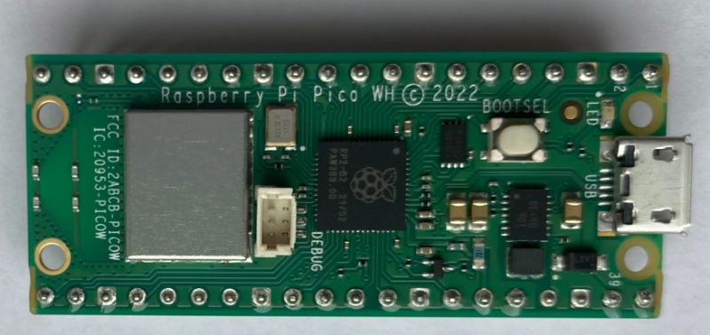
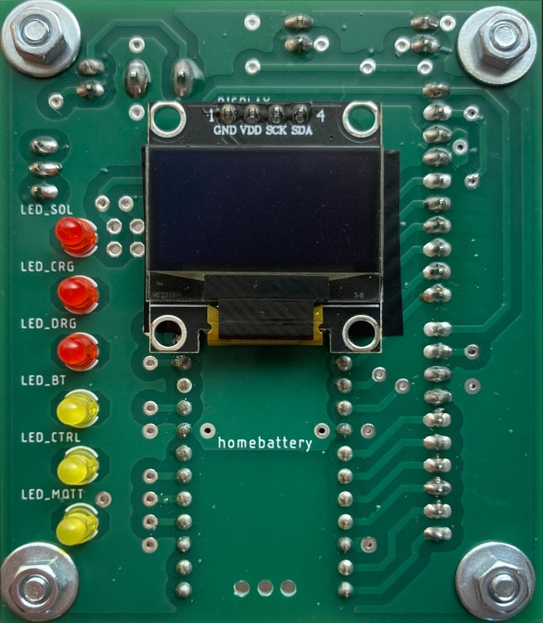
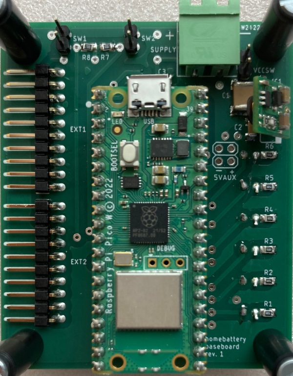
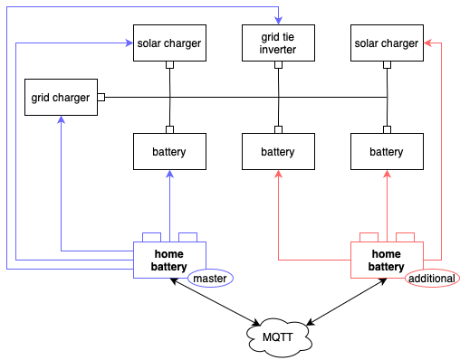
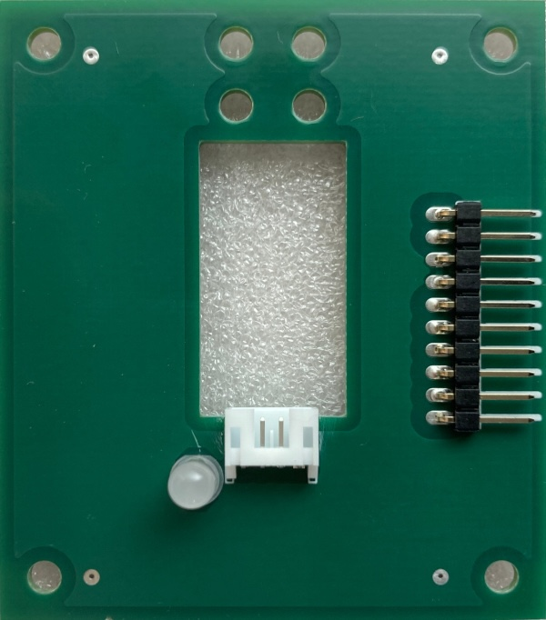
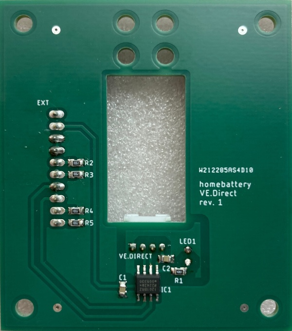

Hardware selection
==================

Raspberry Pico W only setups
----------------------------

homebattery supports running on a bare Raspberry Pico W. The system is then powered via the micro USB port.

This setup comes with some limitations:

* only devices connected via network or Bluetooth can be used
* no display or LEDs

.. _handbook_baseboard:
Raspberry Pico W on baseboard
-----------------------------

The homebattery baseboard features

* an OLED display
* status LEDs
* power via wide voltage range input, 5V input or micro USB
* two extension ports for add-on boards

For more information, see the :doc:`hardware reference <../hardware/baseboard>`.

.. _handbook_multi_controller_setups:
Multi controller setups
-----------------------

If more devices than two add-on boards can connect shall be used, a multi controller setup is necessary.

Example setup:

In a multi controller setup, all inverters and grid chargers are connected to one main controller. Solar chargers and batteries can either be connected to the main controller or to one or more additional controllers.

For more information, see TODO.

Housing
-------

The homebattery PCBs have

* 60x70 mm dimension
* mounting holes for M3 screws
* a height of approx. 75mm for 1 baseboard and 2 add-on boards stacked onto each other

There is no case specifically for home battery, but there are instructions how to use a standard case with transparent front, see the :doc:`hardware reference <../hardware/housing>`.

.. _handbook_addonboards:
Add-on boards
-------------

.. _handbook_ve_direct:
VE.Direct
~~~~~~~~~

Victron SmartSolar and BlueSolar MPPT solar charges can be connected to homebattery using the VE.Direct add-on board.

For more information, see the :doc:`hardware reference <../hardware/vedirect>`.

.. _handbook_rs_485:
RS-485
~~~~~~

RS-485 or modbus devices can be connected to homebattery using the RS-485 add-on board. Cables can be connected via screw terminal or RJ45 jack with any pin configuration. Failsafe resistors and termination can be enabled via solder jumper.

For more information, see the :doc:`hardware reference <../hardware/rs485>`.
