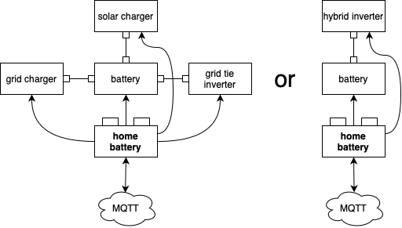

System overview
===============

A typical home battery storage system
-------------------------------------

A home battery storage system controlled by homebattery can consist of the following components:

* batteries
* solar chargers
* grid chargers
* inverters
* heaters
* sensors

These are called **device classes** in the homebattery world.

Some devices out there are a combination of device classes (e.g. a hybrid inverter often combines solar charger, grid charger and inverter).

Homebattery as controller of the system has two main tasks:

* control the chargers and inverters to ensure optimum charging and discharging of the batteries depending on the mode of operation
* monitor the system to prevent unsafe operation states

There is a lot of flexibility regarding the connected devices. There are no mandatory device classes. For example, homebattery can also be used to read data from your solar power plant with no batteries at all.

.. note::
   Homebattery only switches its mode of operation automatically, if this is necessary to protect connected devices.
   The system is designed to receive commands for switching its mode of operation via MQTT.

Modes of operation
------------------

The modes of operation define the energy flow in the system by turning device classes on and off.

The trigger for changing the mode of operation is received via MQTT.

+-----------+-------------------------------------+--------------------------------------------------+
| mode      | grid tie systems                    | hybrid inverter systems                          |
+===========+=====================================+==================================================+
| idle      | charge battery from solar           | feed output from solar + grid                    |
+-----------+-------------------------------------+--------------------------------------------------+
| grid      | charge battery from solar           | feed output from grid,                           |
|           |                                     |                                                  |
|           |                                     | charge battery from solar                        |
+-----------+-------------------------------------+--------------------------------------------------+
| charge    | charge battery from solar + grid    | feed output from grid,                           |
|           |                                     |                                                  |
|           |                                     | charge battery from solar + grid                 |
+-----------+-------------------------------------+--------------------------------------------------+
| discharge | charge battery from solar, activate | feed output from solar + battery                 |
|           | inverter                            |                                                  |
+-----------+-------------------------------------+--------------------------------------------------+
| protect   | everything is off                   | feed output from grid                            |
+-----------+-------------------------------------+--------------------------------------------------+

.. note::
   Mode ``grid`` is not implemented yet.

For more information about modes of operation, see the :doc:`software reference <../software/modes_of_operation>`.

Connecting devices
------------------

There are five device classes:

* battery
* solar
* charger
* inverter
* heater
* sensor

Homebattery is quite flexible when it comes to its connected devices:

* all device classes are optional (e.g. you can have a system without a grid charger)
* there is no hard device limit per class
* batteries and solar devices can be distributed across several controllers (see :ref:`multi controller setups <handbook_multi_controller_setups>`)
* devices can be a combination of device classes (e.g. a hybrid inverter is usally solar, charger and inverter)

There are several ways to connect devices:

* network via WLAN
* Bluetooth (only for batteries)
* wired connection via add-on boards

The used interface depends on the device, see the driver documentation in the :doc:`software reference <../software/drivers>`.

Device class locks
------------------

A configured set of checks is constantly applied on device parameters. If a check fails, the affected device classes are locked (which means that they are switched off) until the check passes again.

Device locks are possible for the following device classes:

* solar
* charger
* inverter

Example: the battery cells are checked for their voltage. While a cell voltage too high locks the device classes solar and charger, a cell voltage too low locks the device class inverter.

The checks and locks are described in the :doc:`software reference <../software/locks>`.

System monitoring
-----------------

There are several ways to monitor the operation of homebattery.

The system status and operating data are sent over :doc:`MQTT <../software/mqtt_interface>` for further usage of your choice.

Depending on your :doc:`hardware selection <hardware_selection>`, system status and some operating data are visualized using display and LEDs.

Detailed information can also be retrieved by the system log, see :doc:`logging <logging>`.

