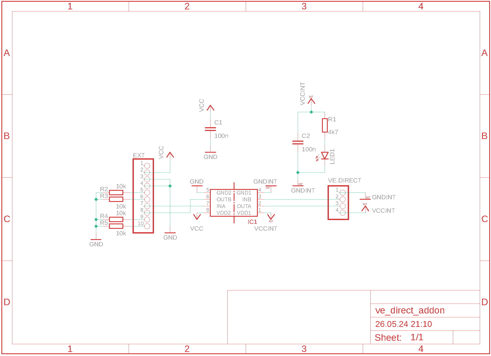
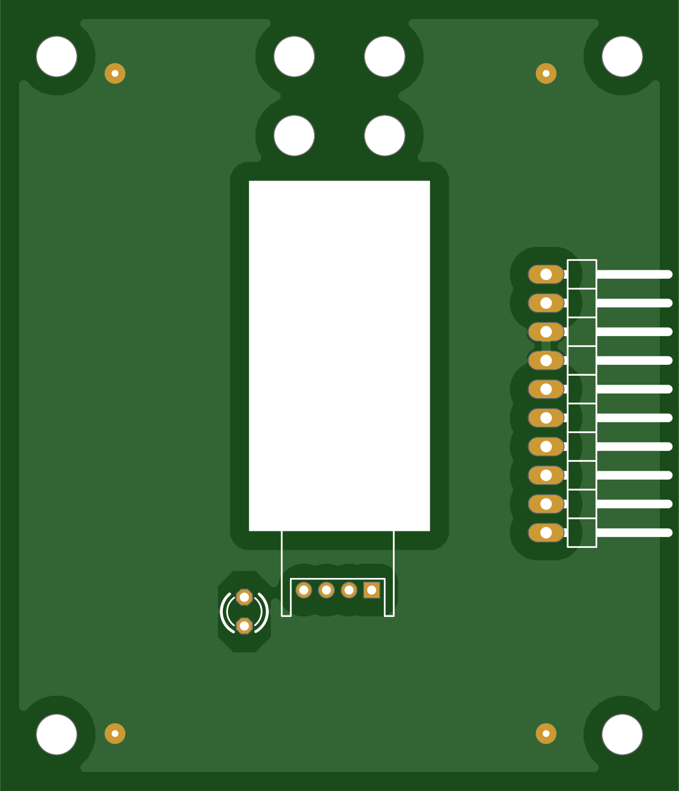
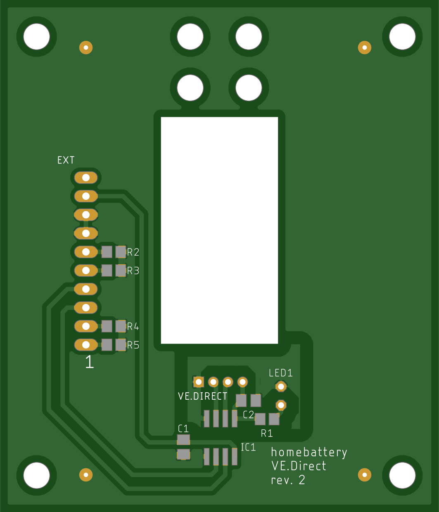

VE.Direct
=========

Schematics
----------

PCB
---

Bill of materials
-----------------

+------------+-----------------------------------------------+--------+-----------------------------------------+
| Name       | Description                                   | Number | Reichelt name / Remark                  |
+============+===============================================+========+=========================================+
| IC1        | ADUM 1201 BRZ SO-8 digital isolator           | 1      | ADUM 1201 BRZ                           |
+------------+-----------------------------------------------+--------+-----------------------------------------+
| C1, C2     | MLCC capacitor 100n 50V 100n G0805            | 2      | KEM X7R0805 100N                        |
+------------+-----------------------------------------------+--------+-----------------------------------------+
| R1         | SMD resistor 4.7k 1/8W 0805                   | 1      | WAL WR08X4701FTL                        |
+------------+-----------------------------------------------+--------+-----------------------------------------+
| R2-5       | SMD resistor 10k 1/8W 0805                    | 4      | WAL WR08X1002FTL                        |
+------------+-----------------------------------------------+--------+-----------------------------------------+
| LED1       | LED red 3mm 60° 150 mcd 20mA                  | 1      | 3004R1D-EHB-A                           |
+------------+-----------------------------------------------+--------+-----------------------------------------+
| EXT        | pin headers 10-pin angled RM 2.54             | 2      | W+P 946-14-010                          |
+------------+-----------------------------------------------+--------+-----------------------------------------+
| EXT        | Dupont cable female 10-pin RM 2.54 15cm       | 1      | buy one from ebay or alixpress          |
+------------+-----------------------------------------------+--------+-----------------------------------------+
| VE.DIRECT  | JST male connector 4-pin RM 2.0 S4B-PH-K-S    | 1      | JST PH4P ST90                           |
+------------+-----------------------------------------------+--------+-----------------------------------------+
